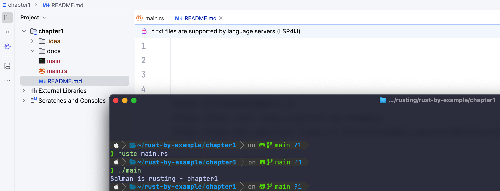
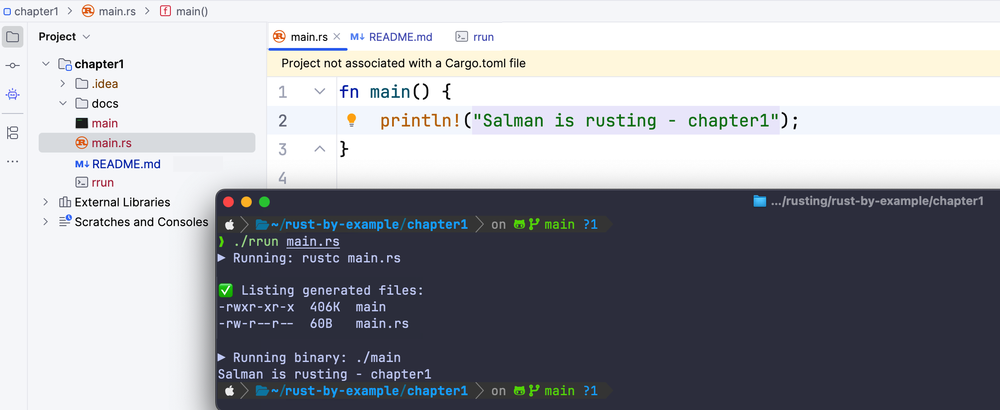

# Learning Source
* The Rust Reference - https://doc.rust-lang.org/reference
* Official Rust by Example - https://doc.rust-lang.org/stable/rust-by-example/
* MIT Rust by Example - https://web.mit.edu/rust-lang_v1.25/arch/amd64_ubuntu1404/share/doc/rust/html/rust-by-example/index.html
* Other Rust by Example - https://rustbyexample.io

#### Check Rust and Cargo install properly or Not
```
❯ rustc --version
rustc 1.79.0 (129f3b996 2024-06-10)

❯ whereis rustc  
rustc: /Users/userName/.cargo/bin/rustc

❯ cargo --version
cargo 1.79.0 (ffa9cf99a 2024-06-03)

```
#### After clone Run the chapter1 codes
```
git clone https://github.com/javagrails/rust-by-example

cd rust-by-example/chapter1
❯ rustc main.rs
❯ ./main
```
It will print
```
Salman is rusting - chapter1
```
in terminal

Same if you run
```
./rrun main.rs
```
console output will be
```
▶ Running: rustc main.rs

📄 Listing generated files:
-rwxr-xr-x  406K  main
-rw-r--r--  60B   main.rs

▶ Running binary: ./main
Salman is rusting - chapter1
```
#### Some Docs


